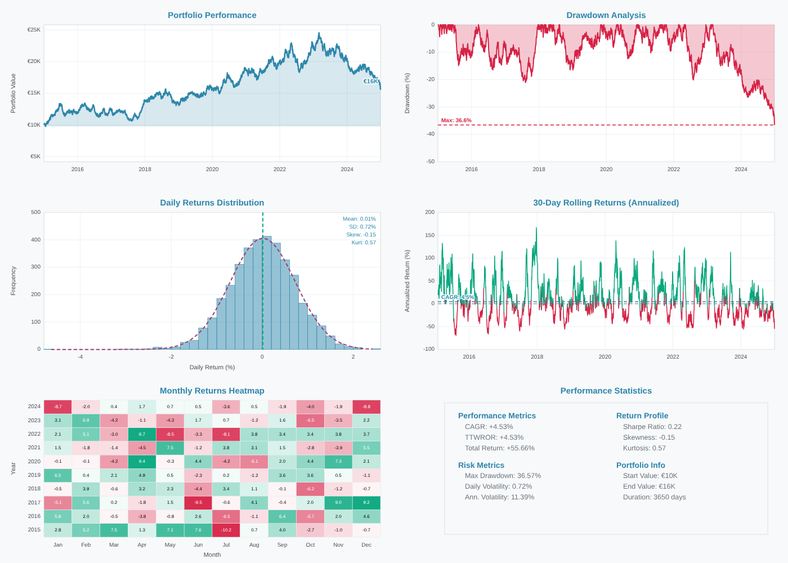

<p align="center">
  
</p>

<h1 align="center">SimLev.jl</h1>

<p align="center">
  <strong>Backtesting für ETF-, Hebel- und Multi-Asset-Strategien – mit deutscher Investmentbesteuerung</strong><br>
</p>

---

**SimLev** rechnet Anlagestrategien auf täglichen Preisreihen durch: von der
einfachen 70/30-Mischung aus Aktien- und Anleihe-ETF über Sparpläne und
Rebalancing bis zu signalgesteuerten Strategien mit gehebelten Produkten.
Der Unterschied zu gängigen Backtest-Werkzeugen ist die **detaillierte
Abbildung des deutschen Steuerrechts**. Vorabpauschale, Teilfreistellung,
Sparer-Pauschbetrag, getrennte Verlusttöpfe nach § 20 und § 23 EStG und die
Günstigerprüfung werden Tag für Tag mitgeführt. Ein Backtest zeigt so nicht
nur das Ergebnis *vor* Steuern, sondern auch, was einem deutschen
Privatanleger am Ende tatsächlich geblieben wäre.

Dieses Paket ist die Julia-Fassung des gleichnamigen R-Pakets. Es läuft
**eigenständig ohne R** und braucht **keine externen Julia-Pakete**, nur die
Standardbibliothek. Die Engine rechnet **bitgleich** zur R-Version: Jeder
Tageswert, jede Kennzahl, jeder Steuerbetrag und auch die Textausgabe stimmen
mit dem R-Paket exakt überein – geprüft an 2.337 Szenarien, siehe
[Bitgleichheit](#bitgleichheit-zum-r-paket). Dabei ist sie 10- bis 35-mal so
schnell wie das R-Paket.

## Inhalt

- [Auf einen Blick](#auf-einen-blick)
- [Installation](#installation)
- [Schnellstart](#schnellstart)
- [Grundkonzepte](#grundkonzepte)
- [Ergebnisse auswerten](#ergebnisse-auswerten)
- [Von R zu Julia](#von-r-zu-julia)
- [Bitgleichheit zum R-Paket](#bitgleichheit-zum-r-paket)
- [Geschwindigkeit](#geschwindigkeit)
- [Wie die Engine arbeitet](#wie-die-engine-arbeitet)
- [Grenzen und wichtige Hinweise](#grenzen-und-wichtige-hinweise)
- [Entwicklung und Tests](#entwicklung-und-tests)
- [Lizenz](#lizenz)

## Auf einen Blick

| Bereich | Was SimLev kann |
|---|---|
| **Handelslogik** | Buy-and-Hold, signalgesteuerte Ein- und Ausstiege, gestaffelte Asset-Starts, Bruchstücke oder ganze Anteile |
| **Kapitalflüsse** | Einmalanlage, Sparpläne (monatlich, quartalsweise, jährlich), wahlweise mit Mini-Rebalancing über die Sparrate |
| **Rebalancing** | Kalenderbasiert, mit Toleranzschwelle oder ereignisbasiert (Hebel- und Volatilitäts-Trigger) |
| **Kosten** | Bid-Ask-Spread je Asset, optional laufende Fondskosten und Performancegebühr |
| **Steuern** | InvStG-Fondsbesteuerung, Abgeltungsteuer nach § 20 EStG, private Veräußerungsgeschäfte nach § 23 EStG |
| **Kennzahlen** | CAGR, TTWROR, Volatilität, Sharpe, Sortino, Calmar, Omega, Ulcer Index, Drawdown-Dauer u. v. m. |
| **Visualisierung** | Statisches Dashboard als SVG (in Jupyter, Pluto und VS Code direkt sichtbar), interaktives HTML-Dashboard |
| **Geschwindigkeit** | 30 Jahre Tagesdaten mit drei Assets, Sparplan, Rebalancing und Steuern in rund 0,02 Sekunden |

## Installation

Benötigt wird **Julia ab Version 1.10**. Weitere Pakete sind nicht nötig.

``` julia
using Pkg
Pkg.develop(path = "pfad/zu/SimLev.jl")        # aus dem entpackten Ordner
# oder aus einem Git-Repository:
# Pkg.add(url = "https://github.com/BENUTZERNAME/SimLev.jl")
```

Beim ersten `using SimLev` kompiliert Julia das Paket einmalig vor (etwa
20–30 Sekunden). Danach lädt es in Sekundenbruchteilen, und schon der erste
Aufruf von `simulation()` ist schnell.

## Schnellstart

Das Beispiel simuliert zehn Jahre einer 70/30-Mischung aus einem Aktien-ETF
(`WORLD`) und einem Anleihe-ETF (`BONDS`). Die Preise sind synthetisch, damit
das Beispiel ohne externe Daten läuft. In der Praxis setzen Sie hier Ihre
eigenen Kursreihen ein. Das vollständige Skript liegt unter
[`examples/schnellstart.jl`](examples/schnellstart.jl).

``` julia
using SimLev, Dates, Random

# 1. Preisdaten: eine Datumsspalte plus eine Preisspalte je Asset
rng = MersenneTwister(42)
n = 365 * 10
data = (date  = collect(Date(2015, 1, 1):Day(1):Date(2015, 1, 1) + Day(n - 1)),
        WORLD = 100 .* cumprod(1 .+ 4e-4 .+ 0.010 .* randn(rng, n)),
        BONDS =  50 .* cumprod(1 .+ 1e-4 .+ 0.003 .* randn(rng, n)))

# 2. Strategie: Gewichte, Kosten und Teilfreistellung
#    (30 % für Aktien-ETFs, 0 % für Renten-ETFs)
strategy = create_strategy(
    WORLD = asset_config("etf", "bnh"; asset_share = 0.7, asset_spread = 0.1, asset_bonus = 30),
    BONDS = asset_config("etf", "bnh"; asset_share = 0.3, asset_spread = 0.1, asset_bonus = 0),
)

# 3. Simulation: 10.000 EUR Einmalanlage, jährliches Rebalancing,
#    deutsche Privatbesteuerung, Verkauf aller Positionen am Ende
result = simulation(data, strategy;
    start_value = 10000,
    balance_mode = true, balance_span = 1, balance_unit = "year",
    tax_mode = "person", tax_rate = 26.375,
    liquidate = true,
    risk_free = 2)
```

```
══════════════════════════════════════════════════════════════
                    SimLev Simulation Results
══════════════════════════════════════════════════════════════

  Performance
  ─────────────────────
  CAGR:             +4.53%
  TTWROR:           +4.53%
  Final Value:      15558.32 EUR

  Risk
  ─────────────────────
  Max Drawdown:     36.57%
  Avg Drawdown:     9.29%
  Ulcer Index:      0.1151
  Longest DD:       666 Tage
  Avg Recovery:     33 Tage

  Ratios
  ─────────────────────
  Sharpe:           +0.247
  Sortino:          +0.245
  Calmar:           +0.124
  ...

  Steuern
  ─────────────────────
  Gezahlte Steuern: 744.73 EUR
  Verlustvortrag:   0.00 EUR (§ 20) / 0.00 EUR (§ 23)
  SPB genutzt:      2044.75 EUR (Ersparnis: 539.30 EUR)
══════════════════════════════════════════════════════════════
```

**So lesen Sie das Ergebnis:** Aus 10.000 EUR wurden nach zehn Jahren, allen
Spreads und allen Steuern 15.558,32 EUR. Das entspricht 4,53 % pro Jahr.
Unterwegs fielen 744,73 EUR Steuern an; ohne den Sparer-Pauschbetrag wären es
539,30 EUR mehr gewesen. Der schlimmste zwischenzeitliche Verlust vom letzten
Höchststand betrug 36,57 %. Bis zum nächsten Höchststand dauerte es im
längsten Fall 666 Tage. Zum Vergleich endet dieselbe Simulation mit
`tax_mode = "none"` bei 16.303,40 EUR (5,02 % p. a.).

`plot_dashboard(result)` erzeugt das zugehörige Dashboard:

<p align="center">
  
</p>

Der Knick am letzten Tag ist kein Kurseinbruch, sondern die Steuer, die mit
`liquidate = true` beim Verkauf aller Positionen fällig wird. Die Option ist
sinnvoll, wenn Sie wissen wollen, was nach Auflösung des Depots *netto*
übrig bleibt.

## Grundkonzepte

### Eingabedaten

SimLev ist eine reine Backtest-Engine. Sie verarbeitet jede Preisreihe genau
so, wie sie übergeben wird. **Hebel, Dividenden und Finanzierungskosten
werden nicht intern berechnet**, sondern müssen in der Preisreihe bereits
enthalten sein.

Erwartet wird eine Tabelle mit

- einer Spalte **`date`** (`Date`, `DateTime`, Text `"JJJJ-MM-TT"` oder Tage seit 1970-01-01),
- **je einer Preisspalte pro Asset**, deren Name exakt dem Asset-Namen in
  der Strategie entspricht,
- optional weiteren Spalten: Kauf- und Verkaufssignale (`Bool`), ein
  täglicher Basiszins für die Vorabpauschale, ein risikoloser Zins oder eine
  Trigger-Spalte für ereignisbasiertes Rebalancing.

Akzeptiert werden ein **NamedTuple von Vektoren**, ein **`Dict`** (Spaltenname
⇒ Vektor) und jede Tabelle, die ihre Spalten über `propertynames` und
`getproperty` bereitstellt – insbesondere ein **`DataFrame`** aus
DataFrames.jl. Fehlende Werte (`missing`) werden wie `NA` in R behandelt.

**Fehlende Kalendertage** wie Wochenenden und Feiertage füllt SimLev
automatisch mit dem letzten bekannten Kurs auf (*Last Observation Carried
Forward*, LOCF). Diese Tage werden in `result.filled` markiert und aus allen
renditebasierten Kennzahlen herausgerechnet. Fällt ein geplantes Ereignis
(Sparrate, Rebalancing, Liquidation) auf einen aufgefüllten Tag, wird es auf
den nächsten echten Handelstag verschoben – oder, falls es dadurch in den
Folgemonat rutschen würde, auf den vorherigen.

### Die Prozent-Konvention

Alle Raten und Schwellen werden **in Prozent** angegeben, nicht als
Dezimalzahl:

| Argument | Beispiel | Bedeutung |
|---|---|---|
| `tax_rate` | `26.375` | 25 % Abgeltungsteuer + 5,5 % Solidaritätszuschlag darauf |
| `asset_spread` | `0.1` | 0,1 % voller Bid-Ask-Spread (je Kauf/Verkauf die Hälfte) |
| `asset_bonus` | `30` | 30 % Teilfreistellung |
| `balance_thresh` | `5` | Rebalancing erst ab 5 % Gewichtsabweichung |
| `base_rate` | `2.55` | 2,55 % Basiszins für die Vorabpauschale |
| `risk_free` | `2` | 2 % risikoloser Zins p. a. |
| `marginal_tax_rate` | `42` | 42 % persönlicher Grenzsteuersatz |

Einzige Ausnahme sind die Zielgewichte `asset_share`. Sie liegen zwischen 0
und 1 und müssen sich auf 1 summieren.

### Assets und Strategien

Jedes Asset wird mit `asset_config()` beschrieben, mehrere Assets fasst
`create_strategy()` zusammen. Die ersten fünf Argumente von `asset_config`
(`asset_class`, `action_type`, `asset_share`, `asset_spread`, `asset_bonus`)
dürfen wie in R positionell oder als Schlüsselwort übergeben werden.

``` julia
strategy = create_strategy(
    WORLD = asset_config("etf", "bnh", 0.6, 0.10, 30),
    EM    = asset_config("etf", "bnh", 0.2, 0.20, 30),
    GOLD  = asset_config("etc"; asset_share = 0.2, deliverable = true),
)

validate_strategy(strategy, data)   # prüft zusätzlich, ob alle Spalten in data existieren
```

Die **Assetklasse** bestimmt automatisch das Steuerregime; mit `tax_regime`
lässt es sich explizit setzen.

| `asset_class` | `deliverable` | Abgeleitetes Steuerregime | Typisches Beispiel |
|---|---|---|---|
| `"etf"` | – | `investment_fund` (InvStG: Teilfreistellung, Vorabpauschale) | Aktien- oder Renten-ETF |
| `"etn"`, `"etc"` | `false` | `capital_gains` (§ 20 EStG, Abgeltungsteuer) | ETC ohne Lieferanspruch |
| `"etn"`, `"etc"` | `true` | `private_sale` (§ 23 EStG, steuerfrei nach einem Jahr) | Physisch hinterlegtes Gold mit Lieferanspruch |
| `"certificate"` | – | `capital_gains` | Zertifikat, Hebelprodukt als Schuldverschreibung |

`add_asset()`, `update_asset()` und `remove_asset()` geben jeweils eine neue
Strategie zurück; `migrate_strategy()` wandelt veraltete Assetklassen um.
`simulation()` akzeptiert außerdem einfache Strategien im Stil einer R-Liste,
etwa `["ETF" => (asset_class = "etf", action_type = "bnh", asset_share = 1.0)]`.

### Buy-and-Hold und Signalstrategien

Mit `action_type = "bnh"` wird ein Asset am ersten Tag gekauft und gehalten.
Mit `action_type = "signal"` steigt es ein und aus, wann immer Ihre
Signalspalten es vorgeben. Die Signale berechnen Sie vorab selbst:

``` julia
sma(x, k) = [i < k ? NaN : sum(@view x[i-k+1:i]) / k for i in eachindex(x)]
s50, s200 = sma(data.WORLD, 50), sma(data.WORLD, 200)
data = merge(data, (buy = s50 .> s200, sell = s50 .< s200))     # NaN-Vergleiche ergeben false

strategy = create_strategy(
    WORLD = asset_config("etf", "signal", 1, 0.1, 30; signal_buy = "buy", signal_sell = "sell"))
```

Solange ein Signal-Asset nicht investiert ist, hält es sein Zielgewicht als
eigene Cash-Reserve; beim Rebalancing wird diese Reserve wie eine Position
behandelt.

### Sparpläne (DCA)

``` julia
result_dca = simulation(data, strategy;
    start_value = 10000,
    dca_mode = true, dca_value = 250, dca_span = 1, dca_unit = "month",
    balance_dca = true,                       # Sparrate füllt zuerst untergewichtete Assets auf
    balance_mode = true, balance_span = 1, balance_unit = "year",
    tax_mode = "person", liquidate = true)
```

**Wichtig bei Sparplänen: CAGR und TTWROR unterscheiden sich.** Die CAGR
bezieht sich auf das Depotwachstum *einschließlich* der Einzahlungen, die
TTWROR (*True Time-Weighted Rate of Return*) rechnet sie heraus. Im
Schnellstart-Beispiel mit 250 EUR Monatsrate wächst das Depot auf rund
47.560 EUR, eine CAGR von 16,6 %; die TTWROR liegt bei 5,0 %. Sie ist die
Zahl, die Sie mit anderen Strategien oder einem Index vergleichen sollten.

### Rebalancing

``` julia
# kalenderbasiert
simulation(data, strategy; balance_mode = true, balance_span = 1, balance_unit = "quarter")
# mit Toleranzschwelle
simulation(data, strategy; balance_mode = true, balance_unit = "year", balance_thresh = 5)
# ereignisbasiert
data = compute_rebal_trigger(data, "vol_band"; threshold = 20, vol_col = "sigma_ewma")
simulation(data, strategy; event_col = "rebal_trigger", event_mode = "replace")
```

| Trigger-Typ | Löst aus, wenn ... |
|---|---|
| `"abs_leverage"` | der Ziel-Hebel absolut um mehr als die Schwelle vom zuletzt umgesetzten Hebel abweicht (`threshold = 10` ⇒ 0,10 Hebelpunkte) |
| `"rel_leverage"` | der Ziel-Hebel relativ um mehr als die Schwelle abweicht (`10` ⇒ 10 %) |
| `"vol_band"` | die Volatilität relativ zum Wert beim letzten Rebalancing um mehr als die Schwelle abweicht |
| `"combined"` | mindestens einer von mehreren Sub-Triggern auslöst, z. B. `triggers = [(type = "abs_leverage", threshold = 10), (type = "vol_band", threshold = 20)]` |

Optional legt `event_weight = (ASSET = "spalte",)` die Zielgewichte an
Event-Tagen aus Datenspalten fest.

### Besteuerung

| `tax_mode` | Bedeutung |
|---|---|
| `"none"` | Keine Steuern, also die reine Brutto-Performance |
| `"person"` | Besteuerung eines deutschen Privatanlegers mit vollständiger FIFO-Lotverwaltung |
| `"funds"` | Vereinfachte Fondshülle: laufende Kosten (`funds_fee`) und Performancegebühr mit High-Watermark (`bonus_fee`) |

Im Modus `"person"` bildet SimLev unter anderem ab: **Teilfreistellung**
(§ 20 InvStG, über `asset_bonus`), **Vorabpauschale** (§ 18 InvStG; Basiszins
fest über `base_rate` oder täglich über `base_rate_flex = true` und
`base_rate_data`; festgesetzt zum 31.12., abgebucht am ersten Handelstag des
Folgejahres, notfalls durch Anteilsverkauf; Anrechnung nach § 19 InvStG),
**Sparer-Pauschbetrag** (`sparer_pauschbetrag`), **getrennte Verlusttöpfe**
nach § 20 und § 23 EStG mit unterjähriger Verlustverrechnung, **private
Veräußerungsgeschäfte** (§ 23 EStG: Haltefrist, `marginal_tax_rate`,
Freigrenze `private_sale_threshold`) und die **Günstigerprüfung**
(`use_guenstigerpruefung = true`).

**Modellphilosophie:** SimLev projiziert die *heutige* Rechtslage in die
Vergangenheit. Ein Backtest beantwortet damit die Frage *„Wie hätte meine
Strategie abgeschnitten, wenn ich damals zu den heutigen Konditionen
investiert hätte?“*.

### Splits bei gehebelten Produkten

Mit `split_mode = true` und `split_thresh = [untere_grenze, obere_grenze]`
bildet SimLev Splits und Zusammenlegungen nach. Übergeben Sie dafür die
Kursreihe *ohne* Split-Bereinigung. Anschaffungskosten aller FIFO-Lots werden
angepasst, Kaufdaten und Haltedauern bleiben erhalten.

## Ergebnisse auswerten

`simulation()` liefert ein `SimLevResult`. Im REPL erscheint automatisch der
Ergebnisblock des R-Pakets; `summary(result)` druckt die Kurzfassung und gibt
die Werte als NamedTuple zurück.

| Feld | Inhalt |
|---|---|
| `dates`, `filled` | Simulationstage (`Vector{Date}`) und Markierung der per LOCF aufgefüllten Tage |
| `worth` | Täglicher Gesamtwert des Depots in EUR |
| `drawdowns` | Täglicher Abstand zum bisherigen Höchststand |
| `cagr`, `ttwror` | Jährliche Wachstumsrate und zeitgewichtete Rendite |
| `statistics` | NamedTuple aller Risiko- und Renditekennzahlen (`result.statistics.sharpe` …) |
| `report` | Je Asset ein NamedTuple täglicher Werte: `result.report["WORLD"].total` (`worth`, `money`, `flows`, `total`, `share`) |
| `tax_report` | Gezahlte Steuern, Verlustvorträge, genutzter Pauschbetrag und dessen Steuerersparnis |
| `buys`, `sells` | Durchschnittliche Anzahl Käufe und Verkäufe pro Jahr je Asset |
| `trades` | *Nur Julia:* alle Lots, Verkäufe, Vorabpauschalen und Gebühren je Asset |

`NA` wird wie in R als besonderes NaN geführt; `isna_strict(x)` unterscheidet
es von `NaN`. Mit `details = true` schreibt `simulation()` das
Ereignisprotokoll des R-Pakets nach `io` (Standard: `stdout`).

**Dashboards:**

``` julia
plot_dashboard(result)                                    # alle Standard-Panels (SVG, im Notebook sichtbar)
plot_dashboard(result; style = "compact")                 # 2×2
plot_dashboard(result; style = "custom", panels = ["performance", "drawdown", "monthly"])
plot_dashboard(result; compare = result_ohne_steuer)      # zwei Strategien nebeneinander
plot_dashboard(result; currency = "€", file = "backtest.svg")

export_dashboard(result, "backtest.svg"; width = 16, height = 10)   # auch .html; .pdf/.png über rsvg-convert
plot_interactive(result; file = "backtest.html")          # interaktiv, offline lauffähig
```

`plot_interactive()` erzeugt ein eigenständiges HTML-Dashboard mit Tooltips,
synchronem Fadenkreuz und ein- und ausblendbaren Serien – zeichengleich zur
HTML-Ausgabe des R-Pakets.

## Von R zu Julia

Funktionsnamen und Argumente sind identisch mit dem R-Paket. Argumente von
`simulation()` werden als Schlüsselwörter (nach dem Semikolon) übergeben.

| R | Julia |
|---|---|
| `NULL` | `nothing` |
| `TRUE` / `FALSE` | `true` / `false` |
| `NA` | `missing` (in Daten) bzw. `NA` |
| `c(20, 400)` | `[20, 400]` |
| `list(A = "w1")` | `(A = "w1",)` |
| `data.frame(...)` | NamedTuple oder `DataFrame(...)` |
| `result$worth` | `result.worth` |
| `result$statistics$sharpe` | `result.statistics.sharpe` |
| `result$report$WORLD$total` | `result.report["WORLD"].total` |
| `print(result)`, `summary(result)` | `display(result)`, `summary(result)` |
| `plot(result)` | `plot_dashboard(result)` |
| `plot_interactive(result)` | `plot_interactive(result)` |

Bewusste Abweichungen vom R-Paket betreffen nur Komfort, Darstellung und
fehlerhafte Eingaben, nie Rechenergebnisse gültiger Eingaben:

- **Doppelte Datumswerte** in `data` führen zu einer Fehlermeldung. R rechnet
  hier stillschweigend mit einem verschobenen Kalender weiter.
- Die **Kopfzeile des interaktiven Dashboards** zeigt in R wegen eines Fehlers
  „CAGR NA% · Sharpe NA“. In Julia stehen dort die echten Werte. Der Rest der
  HTML-Datei ist zeichengleich zur R-Ausgabe.
- Das **statische Dashboard** wird als SVG gezeichnet statt mit R's
  Base-Grafik. Panels, Beschriftungen und Kennzahlen entsprechen dem R-Paket;
  die Normalverteilungskurve ist auf die tatsächliche Klassenbreite skaliert,
  und Monatswerte außerhalb von ±10 % werden in der Randfarbe statt gar nicht
  eingefärbt. `export_html_dashboard()` ist im R-Paket ein Platzhalter und
  schreibt hier das interaktive Dashboard.
- Wie im R-Paket hat das Argument `spread` von `simulation()` keine Wirkung;
  Spreads werden je Asset über `asset_spread` gesetzt.

## Bitgleichheit zum R-Paket

„Bitgleich“ heißt: Für dieselben Eingaben liefert Julia dieselben
IEEE-754-Gleitkommazahlen wie R, ohne jede Toleranz – alle Tageswerte, alle
Kennzahlen, alle Steuerwerte, die Ausgabe von `print(result)` und die
Detailprotokolle von `details = true`. Sogar die Unterscheidung zwischen `NA`
und `NaN` stimmt.

Dafür bildet SimLev.jl nicht nur die Logik, sondern auch die **Rechenweise**
von R exakt nach:

- **80-Bit-`long double` in Software.** R summiert bei `sum()`, `mean()`,
  `var()`, `cumsum()`, `prod()` und `rowSums()` intern mit dem 80-Bit-Format
  der x87-FPU. Julia kennt diesen Typ nicht. SimLev.jl enthält deshalb einen
  eigenen Typ `F80`, der Addition, Subtraktion, Multiplikation, Division,
  Rundung, Über- und Unterlauf und sogar die NaN-Auswahlregeln der x87-FPU
  bitgenau nachbildet (geprüft gegen echtes C-`long double` an über 800.000
  verketteten Operationen).
- **Potenzen** folgen R's Sonderregeln (`x^2` als `x*x`, sonst `pow()` der
  C-Bibliothek). Kalender, `round()`, `format()`, `sprintf()` und Modulo
  verhalten sich wie in R.
- Die **C++-Kerne** des R-Pakets (FIFO, Steuern, Markt-Updates) sind Zeile für
  Zeile übertragen.

**So wurde es geprüft:** `tools/golden_cases.R` und `tools/stress_cases.R`
erzeugen Szenarien, rechnen sie mit dem R-Paket und speichern Eingaben und
Ergebnisse binär exakt. `tools/compare_golden.jl` rechnet dieselben Szenarien
in Julia und vergleicht jeden Wert Bit für Bit:

| Satz | Szenarien | Ergebnis |
|---|---|---|
| Golden Master (gezielte Steuer- und Sonderpfade + Zufallsfälle) | 68 | alle bitgleich |
| Zufallsszenarien aus `golden_cases.R`, neuer Startwert | 638 | alle bitgleich |
| Stressfälle aus `stress_cases.R` (30 Jahre, Totalverlust-Hebel, mehrere Signal-Assets, konstante Preise, Schalttage, Extremwerte, Fehlerpfade) | 1.031 | 1.030 bitgleich, 1 bewusste Abweichung (doppelte Datumswerte) |
| Weitere Stressfälle, neuer Startwert, erst nach Fertigstellung erzeugt | 600 | alle bitgleich |

105 dieser Fälle liegen dem Paket als Regressionstest bei
(`test/golden`, `test/golden_extra`).

**Plattformen:** Weil `F80` in Software rechnet, ist die Bitgleichheit nicht
an ein 80-Bit-`long double` der Plattform gebunden. Die einzige verbleibende
Plattformabhängigkeit ist `pow()` aus der C-Bibliothek (glibc unter Linux).
Unter macOS und Windows können davon abhängige Werte – Fondsgebühren, CAGR
und einige Kennzahlen – im letzten Bit abweichen; die Tests markieren das dort
als bekannte Abweichung. Die Referenz ist R unter Linux x86-64.

## Geschwindigkeit

Gemessen auf derselben Maschine (Mittel aus fünf Läufen, Julia nach dem
Vorkompilieren):

| Szenario | R | Python | Julia |
|---|---|---|---|
| 30 Jahre, 3 Assets, Sparplan, jährliches Rebalancing, Steuern | 0,23 s | 0,077 s | **0,016 s** |
| 30 Jahre, Fondsmodus, Splits, ganze Anteile, Schwellen-Rebalancing | 0,13 s | 0,048 s | **0,021 s** |
| 3,5 Jahre, 3 Assets, zwei Signal-Assets, § 23, Sparplan | 0,071 s | 0,028 s | **0,002 s** |

## Wie die Engine arbeitet

An den meisten Tagen passiert in einem Buy-and-Hold-Depot nichts außer
Kursbewegungen. SimLev unterscheidet daher zwei Pfade: Der **Slow Path** läuft
nur an Tagen, an denen etwas geschieht (Sparrate, Rebalancing, Signal,
Jahreswechsel mit Steuerabrechnung, Split, Liquidation) und verarbeitet jedes
Ereignis vollständig mit Lotverwaltung und Steuerlogik. Alle Tage dazwischen
schreibt der **Fast Path** in einer einfachen Schleife fort.

## Grenzen und wichtige Hinweise

- SimLev ist ein Analysewerkzeug, **keine Steuer- oder Anlageberatung**. Die
  Steuerlogik bildet die wesentlichen Regeln für Privatanleger ab, nicht jeden
  Sonderfall (z. B. Kirchensteuer, ausländische Quellensteuer,
  Ausschüttungen).
- Die Ergebnisse hängen vollständig von der Qualität der übergebenen
  Preisreihen ab.
- Steuersätze und Freibeträge entsprechen der aktuellen Rechtslage und werden
  auf historische Zeiträume angewendet.

## Entwicklung und Tests

``` bash
julia --project -e 'using Pkg; Pkg.test()'                  # 213 Tests, davon 105 Bitgleichheits-Tests gegen R
julia --project tools/compare_golden.jl test/golden         # Golden-Master-Abgleich mit Ausgabe
```

Neue Referenzfälle erzeugen Sie mit R, dem R-Paket SimLev und `jsonlite`:

``` bash
Rscript tools/golden_cases.R  /tmp/golden 500 4711   # Zielordner, Anzahl Zufallsfälle, Startwert
Rscript tools/stress_cases.R  /tmp/stress 1000 90210
julia --project tools/compare_golden.jl /tmp/golden
```

Aufbau des Pakets:

```
src/
  SimLev.jl        Modul, Exporte
  ld80.jl          F80: Software-Nachbildung von x87-long double
  rnum.jl          R-kompatible Numerik (sum, mean, var, pow, …)
  rformat.jl       R-kompatible Textausgabe (sprintf, format, round)
  dates.jl         Datumslogik
  config.jl        asset_config, Strategien
  trigger.jl       compute_rebal_trigger
  data.jl          Eingabetabellen, Kalender-Auffüllung (LOCF)
  core.jl          Zustand, FIFO, Steuer- und Marktkerne (Port der C++-Dateien)
  engine.jl        simulation()
  result.jl        SimLevResult, print/summary
  interactive.jl   interaktives HTML-Dashboard
  dashboard.jl     statisches SVG-Dashboard
  precompile.jl    Arbeitslast für die Vorkompilierung
test/              Testsuite und Golden-Master-Fälle
tools/             Abgleich mit R und Fallgeneratoren
```

## Lizenz

GPL-3, wie das R-Paket. Siehe [LICENSE.md](LICENSE.md).
